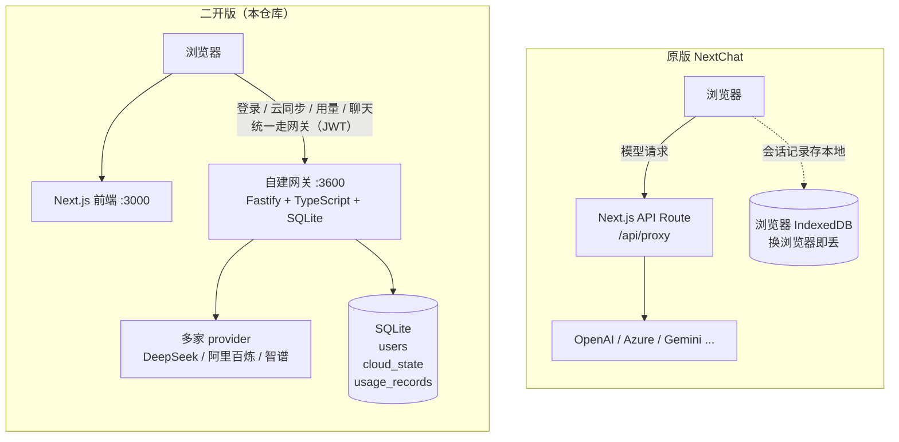

<div align="center">

<a href='https://nextchat.club'>
  
</a>

<h1 align="center">NextChat</h1>

> 🧩 **这是 NextChat 的二次开发版本**：在原版前端之外自建了后端网关，
> 新增「登录鉴权 / 多端会话同步 / 用量统计」三块能力。
> 原版说明原样保留在下方，二开部分请看 👉 [二开版总览](#-二开版总览)。

English / [简体中文](./README_CN.md)

<a href="https://trendshift.io/repositories/5973" target="_blank"></a>

✨ Light and Fast AI Assistant,with Claude, DeepSeek, GPT4 & Gemini Pro support.

[![Saas][Saas-image]][saas-url]
[![Web][Web-image]][web-url]
[![Windows][Windows-image]][download-url]
[![MacOS][MacOS-image]][download-url]
[![Linux][Linux-image]][download-url]

[NextChatAI](https://nextchat.club?utm_source=readme) / [iOS APP](https://apps.apple.com/us/app/nextchat-ai/id6743085599) / [Web App Demo](https://app.nextchat.club) / [Desktop App](https://github.com/Yidadaa/ChatGPT-Next-Web/releases) / [Enterprise Edition](#enterprise-edition)

[saas-url]: https://nextchat.club?utm_source=readme
[saas-image]: https://img.shields.io/badge/NextChat-Saas-green?logo=microsoftedge
[web-url]: https://app.nextchat.club/
[download-url]: https://github.com/Yidadaa/ChatGPT-Next-Web/releases
[Web-image]: https://img.shields.io/badge/Web-PWA-orange?logo=microsoftedge
[Windows-image]: https://img.shields.io/badge/-Windows-blue?logo=windows
[MacOS-image]: https://img.shields.io/badge/-MacOS-black?logo=apple
[Linux-image]: https://img.shields.io/badge/-Linux-333?logo=ubuntu

[](https://zeabur.com/templates/ZBUEFA) [](https://vercel.com/new/clone?repository-url=https%3A%2F%2Fgithub.com%2FChatGPTNextWeb%2FChatGPT-Next-Web&env=OPENAI_API_KEY&env=CODE&project-name=nextchat&repository-name=NextChat) [](https://gitpod.io/#https://github.com/ChatGPTNextWeb/NextChat) [](https://opendeploy.dev/github/ChatGPTNextWeb/NextChat)

[](https://monica.im/?utm=nxcrp)

</div>

<!-- ===================================================================
     以下为二开（fork）新增内容；原版 README 正文原样保留在下方，未做删改。
     =================================================================== -->

## 🧩 二开版总览

> 本仓库是 [NextChat](https://github.com/ChatGPTNextWeb/NextChat) 的**二次开发版本**（fork： `sheep719/NextChat`）。
> 在原版前端之外自建了一个后端网关，补上原版没有的三块能力：**登录鉴权 / 多端会话同步 / 用量统计**。
>
> 二开改动全部在 `dev-gateway` 分支，`main` 保持与上游一致（上游每日自动同步）。

### 一键运行（Docker）

```bash
# 1) 构建镜像（约 5~10 分钟，取决于网络）
docker build -t nextchat-fork:0.2.0 .

# 2) 启动：一个容器同时跑前端(3000) + 网关(3600)
docker run -d --name nextchat \
  -p 3000:3000 -p 3600:3600 \
  -e DEEPSEEK_API_KEY=sk-xxxxxx \
  -v nextchat-data:/gw/data \
  --restart unless-stopped \
  nextchat-fork:0.2.0
```

打开 <http://localhost:3000> → 注册账号 → 即可对话。
不想手敲命令也可以用 `docker compose up -d`（已提供 `docker-compose.yml`，数据落在 `./gateway/data`）。

**不配模型密钥也能起来**：容器零配置可启动，登录、云同步、用量面板都能用，只是聊天会因上游无密钥而报错。

| 环境变量 | 默认 | 说明 |
| --- | --- | --- |
| `DEEPSEEK_API_KEY` / `ALIBABA_API_KEY` / `ZHIPU_API_KEY` | 空 | 上游模型密钥，至少配一个才能对话 |
| `JWT_SECRET` | 首次启动自动生成 | 登录令牌签名密钥；**生产务必显式设置**，并挂卷保存 |
| `GATEWAY_CORS_ORIGINS` | `*` | 浏览器直连网关的跨域白名单；生产改为 `http://你的域名:3000` |
| `REGISTRATION_ENABLED` | `true` | 是否开放注册（内网自用可保持开启） |
| `CHAT_REQUIRE_USER` | `true` | 聊天接口是否只接受登录用户令牌 |
| `USAGE_STREAM_OPTIONS` | `true` | 流式时注入 `stream_options` 拿真实 token；关掉则全部走估算 |
| `WEB_PORT` / `GATEWAY_PORT` | `3000` / `3600` | 容器内监听端口（改了要同步改 `-p`） |
| `DB_PATH` / `DATA_DIR` | `/gw/data/gateway.db` / `/gw/data` | SQLite 位置，建议挂卷 |

### 架构对比：原版 vs 二开版



| 能力 | 原版 | 二开版 |
| --- | --- | --- |
| 模型接入 | 浏览器直连 / Next API Route 代理 | 自建网关统一转发，**按模型名路由**到不同 provider |
| 鉴权 | 页面访问码 `CODE` | API Key + JWT(HS256) 双模式，聊天只认登录用户令牌 |
| 用户体系 | 无 | 注册/登录（scrypt 口令哈希），用户数据隔离 |
| 会话存储 | 浏览器本地 IndexedDB | 云端快照同步，**换浏览器/换设备能看到历史对话** |
| 用量统计 | 无 | 每次调用记录 token（真实值优先、估算兜底），按天图表展示 |
| 部署形态 | 单前端容器 | 单容器同时托管前端 + 网关，一条 `docker run` 起步 |

### 改动清单

| # | 改动 | 主要内容 | 关键文件 |
| --- | --- | --- | --- |
| 1 | 自建网关 + 统一鉴权 | Fastify 多 provider 路由转发、SSE 透传、API Key/JWT 鉴权，改造成 NextChat 自定义 endpoint | `gateway/src/*` |
| 2 | 用户体系 | `users` 表、注册/登录接口、Postman 可直调 | `gateway/src/users.ts`、`gateway/postman/` |
| 3 | 前端登录页 + 云端同步 | `/login` 路由、登录守卫、会话快照上云（乐观锁合并） | `app/store/auth.ts`、`app/utils/gateway-sync.ts` |
| 4 | 用量统计 | `usage_records` 表、流式抓 usage、Recharts 按天面板 | `gateway/src/usage.ts`、`app/components/usage.tsx` |
| 5 | 容器化 | 单镜像双进程 Dockerfile + 启动脚本 + compose | `Dockerfile`、`docker/start.sh` |

对应提交（`defdcdb5..HEAD`，分层提交：网关 / 前端 / 文档 各自独立）：

```
9d8a22e7  feat(gateway): 自建多模型网关 + 统一鉴权 + 用户体系 + 云端同步端点
3890071d  feat(frontend): 登录页与会话云端同步
e6348521  docs: 云端同步文档、台账 C-008 与排障 P-026~P-032
2ef92557  docs: 固化 C-008 提交与推送结果
3a35bef7  feat(gateway): 用量统计——记录每次调用 token 并按天聚合
7fb785f3  feat(frontend): 用量面板——Recharts 按天展示 token 与调用次数
aab579a6  docs: 用量统计文档、台账 C-009 与排障 P-033~P-034
d5450882  feat(docker): 单镜像同时托管前端与网关，支持一键 docker run
```

> 容器化之后的文档提交（README 二开总览、台账 C-010、排障 P-035~P-039）见 `git log`。
> 整版打标签 `v0.2.0`。

> 提交规范与完整台账见 [`docs/secondary-dev-rules.md`](./docs/secondary-dev-rules.md)；
> 环境问题与解法见 [`docs/troubleshooting.md`](./docs/troubleshooting.md)。

### 本地开发

```bash
yarn install          # 前端依赖
yarn dev              # 前端 :3000

cd gateway && npm install && npm run dev   # 网关 :3600（先复制 .env.example 为 .env）
```

### 更多文档

| 文档 | 内容 |
| --- | --- |
| `docs/request-flow.md` | 原版请求链路精读（前端 → API Route → 模型） |
| `docs/gateway-auth.md` | 网关鉴权设计与接入方式 |
| `docs/gateway-user-auth.md` | 用户表/会话表设计与接口 |
| `docs/frontend-cloud-sync.md` | 会话云端同步（整包快照方案） |
| `docs/usage-stats.md` | 用量统计：token 来源、估算兜底、面板实现 |
| `docs/secondary-dev-rules.md` | 二开规则、变更分层与改动台账 |
| `docs/troubleshooting.md` | 环境问题与解法（本机特有许多坑） |
| `gateway/README.md` | 网关端点速查 |

---

## ❤️ Sponsor AI API

<a href='https://302.ai/'>
  
</a>

[302.AI](https://302.ai/) is a pay-as-you-go AI application platform that offers the most comprehensive AI APIs and online applications available.

## 🥳 Cheer for NextChat iOS Version Online!

> [👉 Click Here to Install Now](https://apps.apple.com/us/app/nextchat-ai/id6743085599)

> [❤️ Source Code Coming Soon](https://github.com/ChatGPTNextWeb/NextChat-iOS)


## 🫣 NextChat Support MCP !

> Before build, please set env ENABLE_MCP=true


## Enterprise Edition

Meeting Your Company's Privatization and Customization Deployment Requirements:

- **Brand Customization**: Tailored VI/UI to seamlessly align with your corporate brand image.
- **Resource Integration**: Unified configuration and management of dozens of AI resources by company administrators, ready for use by team members.
- **Permission Control**: Clearly defined member permissions, resource permissions, and knowledge base permissions, all controlled via a corporate-grade Admin Panel.
- **Knowledge Integration**: Combining your internal knowledge base with AI capabilities, making it more relevant to your company's specific business needs compared to general AI.
- **Security Auditing**: Automatically intercept sensitive inquiries and trace all historical conversation records, ensuring AI adherence to corporate information security standards.
- **Private Deployment**: Enterprise-level private deployment supporting various mainstream private cloud solutions, ensuring data security and privacy protection.
- **Continuous Updates**: Ongoing updates and upgrades in cutting-edge capabilities like multimodal AI, ensuring consistent innovation and advancement.

For enterprise inquiries, please contact: **business@nextchat.club**

## Screenshots


## Features

- **Deploy for free with one-click** on Vercel in under 1 minute
- Compact client (~5MB) on Linux/Windows/MacOS, [download it now](https://github.com/Yidadaa/ChatGPT-Next-Web/releases)
- Fully compatible with self-deployed LLMs, recommended for use with [RWKV-Runner](https://github.com/josStorer/RWKV-Runner) or [LocalAI](https://github.com/go-skynet/LocalAI)
- Privacy first, all data is stored locally in the browser
- Markdown support: LaTex, mermaid, code highlight, etc.
- Responsive design, dark mode and PWA
- Fast first screen loading speed (~100kb), support streaming response
- New in v2: create, share and debug your chat tools with prompt templates (mask)
- Awesome prompts powered by [awesome-chatgpt-prompts-zh](https://github.com/PlexPt/awesome-chatgpt-prompts-zh) and [awesome-chatgpt-prompts](https://github.com/f/awesome-chatgpt-prompts)
- Automatically compresses chat history to support long conversations while also saving your tokens
- I18n: English, 简体中文, 繁体中文, 日本語, Français, Español, Italiano, Türkçe, Deutsch, Tiếng Việt, Русский, Čeština, 한국어, Indonesia

<div align="center">
   


</div>

## Roadmap

- [x] System Prompt: pin a user defined prompt as system prompt [#138](https://github.com/Yidadaa/ChatGPT-Next-Web/issues/138)
- [x] User Prompt: user can edit and save custom prompts to prompt list
- [x] Prompt Template: create a new chat with pre-defined in-context prompts [#993](https://github.com/Yidadaa/ChatGPT-Next-Web/issues/993)
- [x] Share as image, share to ShareGPT [#1741](https://github.com/Yidadaa/ChatGPT-Next-Web/pull/1741)
- [x] Desktop App with tauri
- [x] Self-host Model: Fully compatible with [RWKV-Runner](https://github.com/josStorer/RWKV-Runner), as well as server deployment of [LocalAI](https://github.com/go-skynet/LocalAI): llama/gpt4all/rwkv/vicuna/koala/gpt4all-j/cerebras/falcon/dolly etc.
- [x] Artifacts: Easily preview, copy and share generated content/webpages through a separate window [#5092](https://github.com/ChatGPTNextWeb/ChatGPT-Next-Web/pull/5092)
- [x] Plugins: support network search, calculator, any other apis etc. [#165](https://github.com/Yidadaa/ChatGPT-Next-Web/issues/165) [#5353](https://github.com/ChatGPTNextWeb/ChatGPT-Next-Web/issues/5353)
  - [x] network search, calculator, any other apis etc. [#165](https://github.com/Yidadaa/ChatGPT-Next-Web/issues/165) [#5353](https://github.com/ChatGPTNextWeb/ChatGPT-Next-Web/issues/5353)
- [x] Supports Realtime Chat [#5672](https://github.com/ChatGPTNextWeb/ChatGPT-Next-Web/issues/5672)
- [ ] local knowledge base

## What's New

- 🚀 v2.15.8 Now supports Realtime Chat [#5672](https://github.com/ChatGPTNextWeb/ChatGPT-Next-Web/issues/5672)
- 🚀 v2.15.4 The Application supports using Tauri fetch LLM API, MORE SECURITY! [#5379](https://github.com/ChatGPTNextWeb/ChatGPT-Next-Web/issues/5379)
- 🚀 v2.15.0 Now supports Plugins! Read this: [NextChat-Awesome-Plugins](https://github.com/ChatGPTNextWeb/NextChat-Awesome-Plugins)
- 🚀 v2.14.0 Now supports Artifacts & SD
- 🚀 v2.10.1 support Google Gemini Pro model.
- 🚀 v2.9.11 you can use azure endpoint now.
- 🚀 v2.8 now we have a client that runs across all platforms!
- 🚀 v2.7 let's share conversations as image, or share to ShareGPT!
- 🚀 v2.0 is released, now you can create prompt templates, turn your ideas into reality! Read this: [ChatGPT Prompt Engineering Tips: Zero, One and Few Shot Prompting](https://www.allabtai.com/prompt-engineering-tips-zero-one-and-few-shot-prompting/).

## Get Started

1. Get [OpenAI API Key](https://platform.openai.com/account/api-keys);
2. Click
   [](https://vercel.com/new/clone?repository-url=https%3A%2F%2Fgithub.com%2FYidadaa%2FChatGPT-Next-Web&env=OPENAI_API_KEY&env=CODE&project-name=chatgpt-next-web&repository-name=ChatGPT-Next-Web), remember that `CODE` is your page password;
3. Enjoy :)

## FAQ

[English > FAQ](./docs/faq-en.md)

## Keep Updated

If you have deployed your own project with just one click following the steps above, you may encounter the issue of "Updates Available" constantly showing up. This is because Vercel will create a new project for you by default instead of forking this project, resulting in the inability to detect updates correctly.

We recommend that you follow the steps below to re-deploy:

- Delete the original repository;
- Use the fork button in the upper right corner of the page to fork this project;
- Choose and deploy in Vercel again, [please see the detailed tutorial](./docs/vercel-cn.md).

### Enable Automatic Updates

> If you encounter a failure of Upstream Sync execution, please [manually update code](./README.md#manually-updating-code).

After forking the project, due to the limitations imposed by GitHub, you need to manually enable Workflows and Upstream Sync Action on the Actions page of the forked project. Once enabled, automatic updates will be scheduled every hour:


### Manually Updating Code

If you want to update instantly, you can check out the [GitHub documentation](https://docs.github.com/en/pull-requests/collaborating-with-pull-requests/working-with-forks/syncing-a-fork) to learn how to synchronize a forked project with upstream code.

You can star or watch this project or follow author to get release notifications in time.

## Access Password

This project provides limited access control. Please add an environment variable named `CODE` on the vercel environment variables page. The value should be passwords separated by comma like this:

```
code1,code2,code3
```

After adding or modifying this environment variable, please redeploy the project for the changes to take effect.

## Environment Variables

### `CODE` (optional)

Access password, separated by comma.

### `OPENAI_API_KEY` (required)

Your openai api key, join multiple api keys with comma.

### `BASE_URL` (optional)

> Default: `https://api.openai.com`

> Examples: `http://your-openai-proxy.com`

Override openai api request base url.

### `OPENAI_ORG_ID` (optional)

Specify OpenAI organization ID.

### `AZURE_URL` (optional)

> Example: https://{azure-resource-url}/openai

Azure deploy url.

### `AZURE_API_KEY` (optional)

Azure Api Key.

### `AZURE_API_VERSION` (optional)

Azure Api Version, find it at [Azure Documentation](https://learn.microsoft.com/en-us/azure/ai-services/openai/reference#chat-completions).

### `GOOGLE_API_KEY` (optional)

Google Gemini Pro Api Key.

### `GOOGLE_URL` (optional)

Google Gemini Pro Api Url.

### `ANTHROPIC_API_KEY` (optional)

anthropic claude Api Key.

### `ANTHROPIC_API_VERSION` (optional)

anthropic claude Api version.

### `ANTHROPIC_URL` (optional)

anthropic claude Api Url.

### `BAIDU_API_KEY` (optional)

Baidu Api Key.

### `BAIDU_SECRET_KEY` (optional)

Baidu Secret Key.

### `BAIDU_URL` (optional)

Baidu Api Url.

### `BYTEDANCE_API_KEY` (optional)

ByteDance Api Key.

### `BYTEDANCE_URL` (optional)

ByteDance Api Url.

### `ALIBABA_API_KEY` (optional)

Alibaba Cloud Api Key.

### `ALIBABA_URL` (optional)

Alibaba Cloud Api Url.

### `IFLYTEK_URL` (Optional)

iflytek Api Url.

### `IFLYTEK_API_KEY` (Optional)

iflytek Api Key.

### `IFLYTEK_API_SECRET` (Optional)

iflytek Api Secret.

### `CHATGLM_API_KEY` (optional)

ChatGLM Api Key.

### `CHATGLM_URL` (optional)

ChatGLM Api Url.

### `DEEPSEEK_API_KEY` (optional)

DeepSeek Api Key.

### `DEEPSEEK_URL` (optional)

DeepSeek Api Url.

### `HIDE_USER_API_KEY` (optional)

> Default: Empty

If you do not want users to input their own API key, set this value to 1.

### `DISABLE_GPT4` (optional)

> Default: Empty

If you do not want users to use GPT-4, set this value to 1.

### `ENABLE_BALANCE_QUERY` (optional)

> Default: Empty

If you do want users to query balance, set this value to 1.

### `DISABLE_FAST_LINK` (optional)

> Default: Empty

If you want to disable parse settings from url, set this to 1.

### `CUSTOM_MODELS` (optional)

> Default: Empty
> Example: `+llama,+claude-2,-gpt-3.5-turbo,gpt-4-1106-preview=gpt-4-turbo` means add `llama, claude-2` to model list, and remove `gpt-3.5-turbo` from list, and display `gpt-4-1106-preview` as `gpt-4-turbo`.

To control custom models, use `+` to add a custom model, use `-` to hide a model, use `name=displayName` to customize model name, separated by comma.

User `-all` to disable all default models, `+all` to enable all default models.

For Azure: use `modelName@Azure=deploymentName` to customize model name and deployment name.

> Example: `+gpt-3.5-turbo@Azure=gpt35` will show option `gpt35(Azure)` in model list.
> If you only can use Azure model, `-all,+gpt-3.5-turbo@Azure=gpt35` will `gpt35(Azure)` the only option in model list.

For ByteDance: use `modelName@bytedance=deploymentName` to customize model name and deployment name.

> Example: `+Doubao-lite-4k@bytedance=ep-xxxxx-xxx` will show option `Doubao-lite-4k(ByteDance)` in model list.

### `DEFAULT_MODEL` （optional）

Change default model

### `VISION_MODELS` (optional)

> Default: Empty
> Example: `gpt-4-vision,claude-3-opus,my-custom-model` means add vision capabilities to these models in addition to the default pattern matches (which detect models containing keywords like "vision", "claude-3", "gemini-1.5", etc).

Add additional models to have vision capabilities, beyond the default pattern matching. Multiple models should be separated by commas.

### `WHITE_WEBDAV_ENDPOINTS` (optional)

You can use this option if you want to increase the number of webdav service addresses you are allowed to access, as required by the format：

- Each address must be a complete endpoint
  > `https://xxxx/yyy`
- Multiple addresses are connected by ', '

### `DEFAULT_INPUT_TEMPLATE` (optional)

Customize the default template used to initialize the User Input Preprocessing configuration item in Settings.

### `STABILITY_API_KEY` (optional)

Stability API key.

### `STABILITY_URL` (optional)

Customize Stability API url.

### `ENABLE_MCP` (optional)

Enable MCP（Model Context Protocol）Feature

### `SILICONFLOW_API_KEY` (optional)

SiliconFlow API Key.

### `SILICONFLOW_URL` (optional)

SiliconFlow API URL.

### `AI302_API_KEY` (optional)

302.AI API Key.

### `AI302_URL` (optional)

302.AI API URL.

## Requirements

NodeJS >= 18, Docker >= 20

## Development

[](https://gitpod.io/#https://github.com/Yidadaa/ChatGPT-Next-Web)

Before starting development, you must create a new `.env.local` file at project root, and place your api key into it:

```
OPENAI_API_KEY=<your api key here>

# if you are not able to access openai service, use this BASE_URL
BASE_URL=https://chatgpt1.nextweb.fun/api/proxy
```

### Local Development

```shell
# 1. install nodejs and yarn first
# 2. config local env vars in `.env.local`
# 3. run
yarn install
yarn dev
```

## Deployment

### Docker (Recommended)

```shell
docker pull yidadaa/chatgpt-next-web

docker run -d -p 3000:3000 \
   -e OPENAI_API_KEY=sk-xxxx \
   -e CODE=your-password \
   yidadaa/chatgpt-next-web
```

You can start service behind a proxy:

```shell
docker run -d -p 3000:3000 \
   -e OPENAI_API_KEY=sk-xxxx \
   -e CODE=your-password \
   -e PROXY_URL=http://localhost:7890 \
   yidadaa/chatgpt-next-web
```

If your proxy needs password, use:

```shell
-e PROXY_URL="http://127.0.0.1:7890 user pass"
```

If enable MCP, use：

```
docker run -d -p 3000:3000 \
   -e OPENAI_API_KEY=sk-xxxx \
   -e CODE=your-password \
   -e ENABLE_MCP=true \
   yidadaa/chatgpt-next-web
```

### Shell

```shell
bash <(curl -s https://raw.githubusercontent.com/Yidadaa/ChatGPT-Next-Web/main/scripts/setup.sh)
```

## Synchronizing Chat Records (UpStash)

| [简体中文](./docs/synchronise-chat-logs-cn.md) | [English](./docs/synchronise-chat-logs-en.md) | [Italiano](./docs/synchronise-chat-logs-es.md) | [日本語](./docs/synchronise-chat-logs-ja.md) | [한국어](./docs/synchronise-chat-logs-ko.md)

## Documentation

> Please go to the [docs][./docs] directory for more documentation instructions.

- [Deploy with cloudflare (Deprecated)](./docs/cloudflare-pages-en.md)
- [Frequent Ask Questions](./docs/faq-en.md)
- [How to add a new translation](./docs/translation.md)
- [How to use Vercel (No English)](./docs/vercel-cn.md)
- [User Manual (Only Chinese, WIP)](./docs/user-manual-cn.md)

## Translation

If you want to add a new translation, read this [document](./docs/translation.md).

## Donation

[Buy Me a Coffee](https://www.buymeacoffee.com/yidadaa)

## Special Thanks

### Contributors

<a href="https://github.com/ChatGPTNextWeb/ChatGPT-Next-Web/graphs/contributors">
  
</a>

## LICENSE

[MIT](https://opensource.org/license/mit/)
