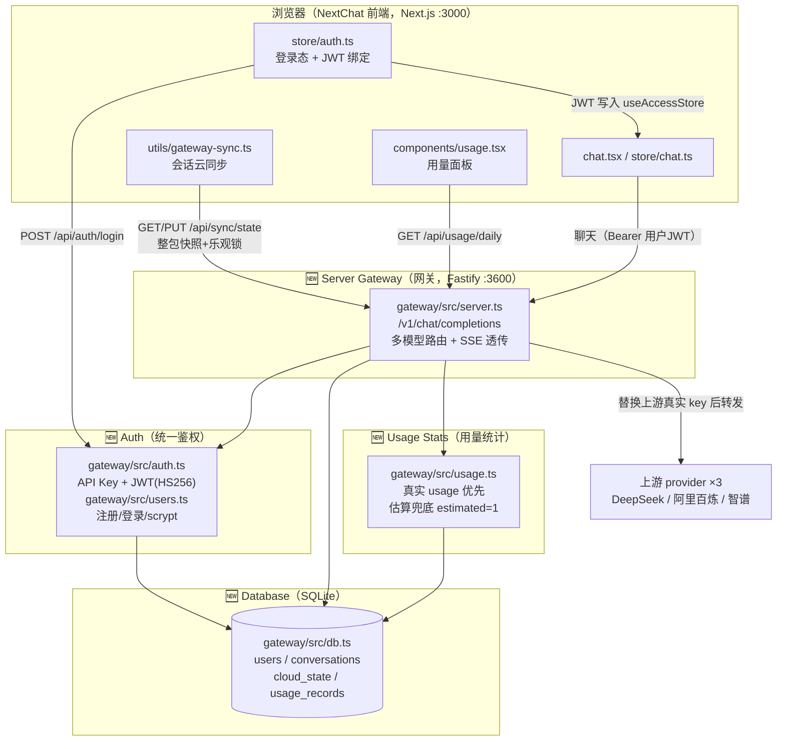

# 改动后架构：自建网关四模块接入（after）

> 用途：满足验收标准 AC-DOC-03 的 after 文档。
> 与 `docs/architecture-before.md`（原版链路）对照阅读。
> 明确标出新增的 4 个模块：**Server Gateway（网关）/ Auth（鉴权）/ Database（用户库）/ Usage Stats（用量统计）**。

## 改动后整体链路（Mermaid）

## 四个新增模块说明

| 模块 | 位置 | 职责 | 关键文件 |
|---|---|---|---|
| **Server Gateway** | `gateway/`（独立 Fastify 服务 :3600） | OpenAI 兼容入口 `/v1/chat/completions`，按 `model` 名路由到 3 家 provider（精确 + 前缀匹配），SSE 流式透传 | `gateway/src/server.ts`、`gateway/src/config.ts` |
| **Auth** | 网关内 | API Key + JWT(HS256) 双模式；聊天接口只认 `typ=user` 的登录令牌；scrypt 口令哈希 | `gateway/src/auth.ts`、`gateway/src/users.ts` |
| **Database** | 网关内（SQLite） | 5 张表：users / conversations / messages / cloud_state / usage_records，字段说明见 `docs/schema.md` | `gateway/src/db.ts` |
| **Usage Stats** | 网关 + 前端 | 每次调用记录 token：非流式解析 usage，流式注入 `stream_options.include_usage`，拿不到按内容估算（`estimated=1` 标记）；Recharts 按天面板 | `gateway/src/usage.ts`、`app/components/usage.tsx` |

## 前端侧新增（不在四模块内，但属于链路变化）

| 文件 | 职责 |
|---|---|
| `app/store/auth.ts` | 登录态；登录成功把 JWT 写入 `useAccessStore`（`openaiUrl` 指网关、`openaiApiKey` 用 JWT），聊天请求天然带身份走网关 |
| `app/utils/gateway-sync.ts` | ChatSyncer：会话整包快照上云，按 `lastUpdate` 合并、去抖 3s 上传、409 冲突重试 |
| `app/components/login.tsx` + `app/login/page.tsx` | 独立 `/login` 路由（登录/注册页） |
| `app/components/home.tsx` | 登录守卫：未登录跳 `/login` |
| `app/components/usage.tsx` | 用量面板（HashRouter 子页 `/#/usage`） |

## 与原版链路的逐点对比

| 对比项 | 原版（见 architecture-before.md） | 改动后 |
|---|---|---|
| 聊天请求路径 | `store/chat.ts → client/api.ts → platforms/*.ts → /api/<provider>（Next API Route）→ 厂商` | `store/chat.ts → client/api.ts（OpenAI 通道）→ **网关 :3600** → 厂商` |
| 鉴权 | 页面访问码 `CODE`（md5）+ 服务端注入系统 key | 网关统一鉴权：登录换 JWT（7 天），聊天只认用户令牌 |
| 用户体系 | 无（浏览器本地即用户） | SQLite `users` 表，注册/登录，数据按 `user_id` 隔离 |
| 会话存储 | 浏览器 IndexedDB（换设备即丢） | `cloud_state` 快照上云，换浏览器登录即恢复 |
| 用量统计 | 无 | `usage_records` 每调用一条，面板按天聚合展示 |
| 新增模型商 | 新增 `platforms/*.ts` + `api/*.ts` + 前端注册 | 网关 `config.ts` 加一项 + `.env` 加 key |
