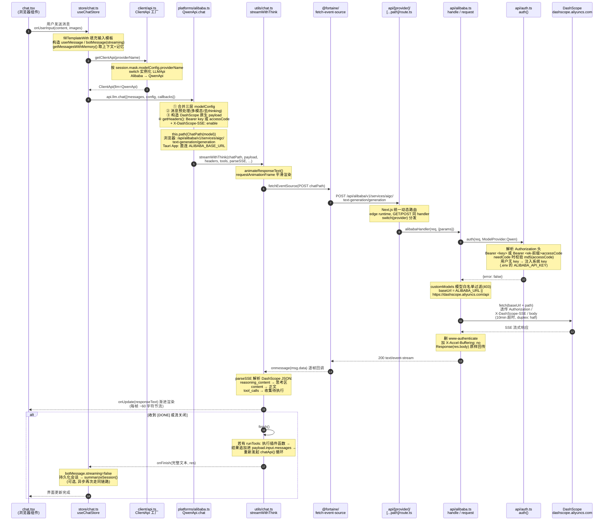
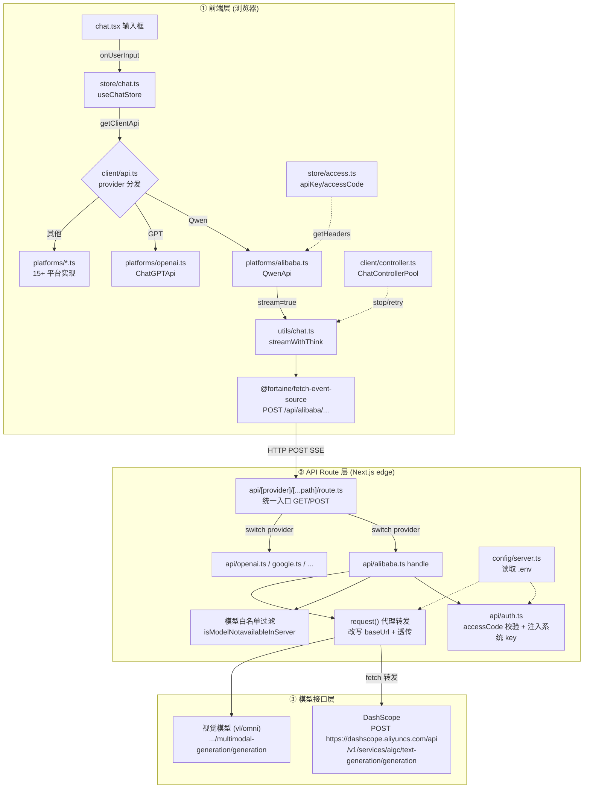
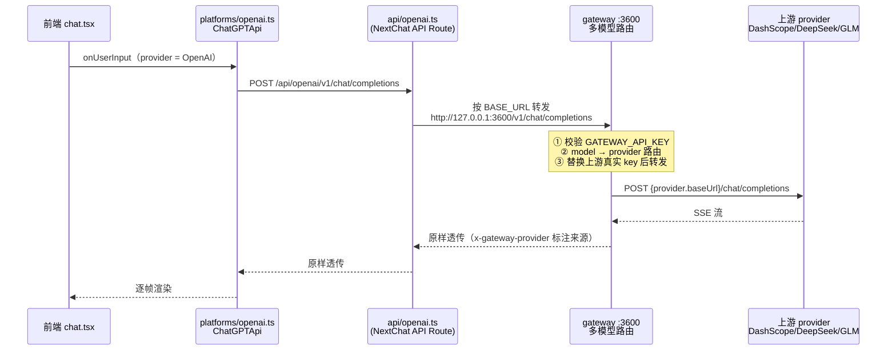

# NextChat 请求链路精读：前端 → API Route → 模型接口

> 本文以 **Qwen（阿里云 DashScope）** 为例梳理完整调用链路（本地部署默认配置），
> 其他 provider（OpenAI / Claude / Gemini 等）链路同构，仅平台实现类与转发地址不同。
> 所有路径均相对仓库根目录，行号基于当前 commit，阅读时以函数名为准。

---

## 一、总览时序图



## 二、分层结构图



---

## 三、分层精读笔记

### ① 前端层：从输入框到 HTTP 请求

**1. 入口 `app/components/chat.tsx`**
用户在输入框回车/点击发送，调用 `chatStore.onUserInput(userInput, attachImages)`。

**2. 状态层 `app/store/chat.ts` → `onUserInput()`（L407）**
- `fillTemplateWith(content, modelConfig)`：按会话模板填充用户输入（默认模板原样透传）；
- 有图片时构造多模态 `content[]`（text + image_url）；
- 创建 `userMessage` 和占位 `botMessage`（`streaming: true`）先写入 session，界面立即出现气泡；
- `getMessagesWithMemory()`：合并 mask 上下文、历史消息裁剪（按 `historyMessageCount`）、超长压缩记忆 prompt、MCP system prompt；
- `getClientApi(modelConfig.providerName)`（L459）拿到对应平台的 `ClientApi`，随后 `api.llm.chat({...})` 发起请求，回调里驱动 UI 更新；
- `onController` 把 `AbortController` 注册进 `ChatControllerPool`（`app/client/controller.ts`），支撑「停止」按钮和重试。

**3. 平台分发 `app/client/api.ts`**
- `ClientApi` 构造函数按 `ModelProvider` switch，把 `this.llm` 实例化为 `QwenApi` / `ChatGPTApi` / `ClaudeApi` 等 15+ 平台类（全部实现 `LLMApi` 抽象接口：`chat / speech / usage / models`）；
- `getHeaders()`：按 provider 从 `useAccessStore` 取对应 key，组装 `Authorization: Bearer <key>`；无 key 且开启访问控制时，降级为 `Bearer <ACCESS_CODE_PREFIX>accessCode`（`ek-` 前缀标记这是访问码不是 API key）。

**4. Qwen 实现 `app/client/platforms/alibaba.ts` → `QwenApi.chat()`**
- 合并三层配置：全局 `modelConfig` ← 会话 `mask.modelConfig` ← 本次请求 `options.config`（后者优先级高）；
- 消息预处理：视觉模型（`isVisionModel`）走 `preProcessImageContentForAlibabaDashScope` 转 DashScope 图片格式；assistant 消息剥离 thinking 段；
- 构造 **DashScope 原生**（非 OpenAI 兼容格式）payload：

```json
{
  "model": "qwen-plus",
  "input": { "messages": [...] },
  "parameters": {
    "result_format": "message",
    "incremental_output": true,   // 流式增量输出
    "temperature": 0.5,
    "top_p": 0.99                  // qwen 要求 top_p < 1，代码里做了 1→0.99 的修正
  }
}
```

- URL 由 `this.path()` 决定：用户在设置里勾了自定义接口则直连 `accessStore.alibabaUrl`；否则浏览器端走**相对路径** `/api/alibaba`（即同源 API Route），Tauri 桌面端（`isApp`）直连 `https://dashscope.aliyuncs.com/api/`；
- 真实 path 由 `Alibaba.ChatPath(model)`（`app/constant.ts`）决定：模型名含 `vl`/`omni` → `v1/services/aigc/multimodal-generation/generation`，否则 → `v1/services/aigc/text-generation/generation`；
- 附加头 `X-DashScope-SSE: enable`（DashScope 的流式开关，不是标准 SSE 头）。

**5. 流式处理 `app/utils/chat.ts` → `streamWithThink()`（L392）**
- `animateResponseText()`：用 `requestAnimationFrame` 每帧从 `remainText` 取 ~60 字符追加到 `responseText`，让输出有"打字机"平滑感（**渲染节流与网络帧解耦**）；
- 内部 `chatApi()` 调 `@fortaine/fetch-event-source` 的 `fetchEventSource()` 发起 POST：
  - `onopen`：校验 `content-type` 必须 `text/event-stream` 且 200，否则把错误文本拼进回复并 `finish()`；
  - `onmessage`：`[DONE]` → `finish()`；否则 `parseSSE(text, runTools)` 解析每帧 JSON——`reasoning_content` 标记 `isThinking: true`（前端折叠为"思考过程"块），`content` 是正文增量，`tool_calls` 累积待执行工具；
  - `finish()`：若有 `runTools`，执行本地插件函数 → `processToolMessage` 把 `tool_calls` 消息和工具结果追加进 `payload.input.messages` → **重新调用 `chatApi()` 发起第二轮请求**（工具调用循环），直到无工具调用才真正结束；
- `app/utils/stream.ts` 的 `fetch` 封装：仅 Tauri 桌面端生效（Rust 侧 `stream_fetch` 命令），浏览器回落原生 `window.fetch`。

### ② API Route 层：鉴权与代理转发

**6. 统一入口 `app/api/[provider]/[...path]/route.ts`**
- 一条动态路由承接所有 provider：`/api/<provider>/<path...>`，GET/POST 导出同一 `handle`；
- `runtime = "edge"`（Vercel Edge Function）；
- 按 `/api/${params.provider}` switch 分发到各 `api/<provider>.ts` 的 `handle`，未匹配的走 `api/proxy.ts` 兜底。

**7. 阿里转发 `app/api/alibaba.ts`**
- `OPTIONS` 预检直接 200；
- `auth(req, ModelProvider.Qwen)` 鉴权（见下）；
- `serverConfig.customModels` 配置时解析 body 中的 `model` 字段，命中黑名单返回 403（`isModelNotavailableInServer`）；
- `request()`：
  - `baseUrl = serverConfig.alibabaUrl || "https://dashscope.aliyuncs.com/api/"`（来自 `.env` 的 `ALIBABA_URL`）；
  - `path` = 请求路径去掉 `/api/alibaba` 前缀（即恢复成 DashScope 真实 path）；
  - 服务端 `fetch` 转发：透传客户端的 `Authorization`、`X-DashScope-SSE`、原始 body；10 分钟超时；`duplex: "half"` + `redirect: "manual"` 支持流式请求体；
  - 响应处理：删除 `www-authenticate`（防止浏览器弹认证框）、设置 `X-Accel-Buffering: no`（禁用 nginx 缓冲，保证 SSE 实时性），`new Response(res.body)` 把上游流**原样透传**回浏览器（服务端不解析内容）。

**8. 鉴权 `app/api/auth.ts` → `auth()`**
- 解析 `Authorization` 头：`Bearer ek-xxx` → 访问码（`ek-` 前缀）；`Bearer sk-xxx` → 用户自己的 API key；
- 访问码校验：`md5(accessCode)` 与 `serverConfig.codes`（`.env` 的 `CODE`，逗号分隔、服务端存 md5）比对；配置了 `CODE` 且校验失败 → 401；
- **关键注入逻辑**：用户请求没带自己的 API key 时，按 provider 注入系统级 key（Qwen → `serverConfig.alibabaApiKey`，即 `.env` 的 `ALIBABA_API_KEY`），改写 `req.headers.Authorization` 后再转发——所以本地部署时浏览器不需要填任何 key；
- `HIDE_USER_API_KEY=1` 时禁止用户自带 key。

**9. 服务端配置 `app/config/server.ts`**
- `getServerSideConfig()` 读取 `.env` / 环境变量：`ALIBABA_API_KEY` 存在时 `isAlibaba = true`，`/api/config` 会把 Qwen 加入可用 provider 列表下发给前端。

### ③ 模型接口层：DashScope

**10. 最终请求**

```http
POST https://dashscope.aliyuncs.com/api/v1/services/aigc/text-generation/generation
Authorization: Bearer sk-****            ← auth() 注入的系统 key
X-DashScope-SSE: enable                  ← DashScope 流式开关
Content-Type: application/json

{ "model": "qwen-plus", "input": {...}, "parameters": { "result_format": "message", "incremental_output": true, ... } }
```

响应为 SSE 流，每帧 `data:` 后是 JSON：

```json
{ "output": { "choices": [{ "message": { "content": "增量文本", "reasoning_content": "思考增量", "tool_calls": [] } }] }, "usage": {...} }
```

---

## 四、接入自建网关后的链路变化（C-003 待接入）

若把主应用的 OpenAI 通道指向自建网关（`gateway/`，见 `docs/secondary-dev-rules.md`），链路变为：



与原生链路的差异：

| 对比项 | 原生链路 | 走网关 |
|---|---|---|
| 平台实现 | `platforms/<各家>.ts` 各自构造不同格式 | 统一 OpenAI 格式，网关内部异构适配 |
| key 注入位置 | NextChat 服务端 `api/auth.ts` | 网关 `src/server.ts`（主应用只持网关 key） |
| 新增模型商 | 需新增 `platforms/*.ts` + `api/*.ts` + 前端注册 | 网关 `config.ts` 加一项即可 |
| 主应用改动 | — | 仅 `.env` 加 `OPENAI_API_KEY` + `BASE_URL`（L1 配置层） |

> 接入尚未执行，待确认后施工并回填台账。

## 五、关键设计要点

| 设计 | 位置 | 说明 |
|---|---|---|
| API key 不暴露给浏览器 | `api/auth.ts` L57-121 | 浏览器只带 accessCode（或空），系统 key 在服务端注入后转发 |
| 服务端纯透传 | `api/alibaba.ts` L113-125 | 不解析响应体，`res.body` 流式原样回传，天然支持 SSE |
| 前后端同构 payload | `platforms/alibaba.ts` | payload 即 DashScope 原生格式，Tauri 端可绕过 Route 直连 |
| 打字机动画与网络帧解耦 | `utils/chat.ts` | rAF 每帧 60 字符消费 `remainText`，网络快慢不影响渲染节奏 |
| 工具调用循环 | `utils/chat.ts` finish() | tool_calls → 本地执行 → 追加 messages → 重发请求，直到无工具调用 |
| 停止/重试 | `client/controller.ts` | `ChatControllerPool` 按 `sessionId,messageId` 管理 AbortController |
| 鉴权头复用 | `api.ts getHeaders()` | 同一个 `Authorization` 头双重语义：真 key / `ek-` 访问码，服务端 `parseApiKey` 区分 |
